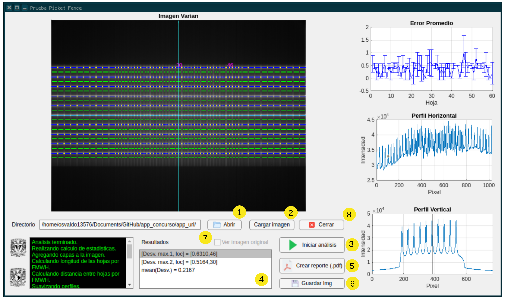

<p align="center">
	  
</p>

# Aplicación Picket Fence
<div align="justify"> 
Esta aplicación diseñada en App Designer de MATLAB para correr en sistemas Windows(86x_64) y Linux. El programa fue diseñado con la intención de llevar a cabo el análisis de imágenes DICOM obtenidas de la prueba Picket Fence
acorde al TG-142 de la AAPM. Dicha prueba busca corroborar el correcto funcionamiento del colimador multihojas (MLC) mediante un estudio de imagen, en el cuál se buscará detectar anomalías en el posicionamiento
de las mismas mediante software de procesamiento en búsqueda de discrepancias en el posicionamiento del sistema colimador<sub>1</sub>.

<br />
<br />

En esta aplicación se realizó el análisis exhaustivo mediante la plataforma de programación MATLAB, donde se realiza un análsis exhaustivo de dos imágenes DICOM tomadas por un acelerador del fabricante Varian, y una
del fabricante Elekta. La aplicación tiene como objetivo el comparar las posiciones de los pixeles con mayor intensidad con los de su alrededor con la finalidad de encontrar aquellos con la mayor intensidad y 
clasificarlos como 'máximos' respecto al resto, una vez localizado estos 'máximos', el siguiente paso es obtener la desviación estándar de estas posiciones y graficarlas. Como siguiente paso, el programa localiza
el promedio de la desviación estándar, al igual que su máximo, y despliega esta información en una tabla para su rápida visualización. Finalmente, es posible guardar la imagen del análisis y crear un reporte en 
formato .pdf para almacenar la información obtenida del análisis.

</div>

## Requerimientos 

- [x] Tener instalado `git` en su sistema.
- [x] [MATLAB](https://la.mathworks.com/store/)  en su versión 2020a o recientes.
- [x] Sistemas operativos Windows(86x_64) y Linux.
- [x] Imágenes DICOM de prueba Picket Fence.


# Ejecución de la interfaz gráfica de usuario
## Descarga del repositorio
```sh
git clone https://github.com/osvaldo13576/DIFM23
```
## Ejecución de la aplicación
Una vez descargado el repositorio, se debe abrir la aplicación en MATLAB, para ello se debe abrir el archivo `Prueba_PF.m` y ejecutarlo. Una vez ejecutado, se desplegará la interfaz gráfica de usuario. Dentro de MATLAB ejecutar el siguiente comando
```sh
Prueba_PF
```
### Ejecución de la aplicación desde la consola
Este método es útil para ejecutar la aplicación desde la consola de comandos de Windows o Linux. Para ello, se debe abrir la consola de comandos y ejecutar la siguiente línea para abrir la carpeta contenedora de la aplicación, por ejemplor si el directorio es `C:\Users\PC\Documents\GitHub\DIFM23`:
```sh
cd C:\Users\PC\Documents\GitHub\DIFM23
```
Ejecutar la aplicación desde la consola de comandos de Windows o Linux con la siguiente línea:
```sh
matlab -nosplash -nodesktop -r "Prueba_PF"
```

## Interfaz gráfica de usuario
<p align="center">
	  
</p>

### Uso de la aplicación
1. Abir: Permite seleccionar la imagen a analizar, la cual debe ser una imagen DICOM, solo admite imágenes de los fabricantes Varian y Elekta proporcionados por la SMFM.
2. Cargar imagen: Carga la imagen seleccionada en la gráfica en blanco de la parte superior, así como sus perfiles horizontal y vertical. Es posible hacer clic sobre la imagen para obtener la coordenada y graficar los perfiles.
3. Iniciar análisis: Inicia el proceso de análisis de la imagen seleccionada, desplegando visualmente una imagen la cual contiene el ancho y separación de las láminas, desviación promedio, así como la desviación estándar máxima con su par de láminas, así mismo, se despliega la gráfica de error promedio. 
4. Despliega los resultados del análisis del punto anterior.
5. Crear reporte (.pdf): Genera un reporte en archivo .pdf de los resultados en la aplicación.
6. Guardar Img: Guarda la imagen resultante del análisis.
7. Ver imagen original: Muestra la imagen original seleccionada.
8. Cerrar: Finaliza la aplicación.


### Referencias

<a id="1">[1]</a>
Klein, E. E., Hanley, J., Bayouth, J. E., Yin, F., Simon, W. E., Dresser, S., Serago, C. F., Aguirre, F. A., Ma, L., Arjomandy, B., Liu, C., Sandin, C., & Holmes, T. C. (2009). Task Group 142 Report: Quality Assurance of Medical AcceleratorsA). Medical Physics, 36(9Part1), 4197-4212. https://doi.org/10.1118/1.3190392

